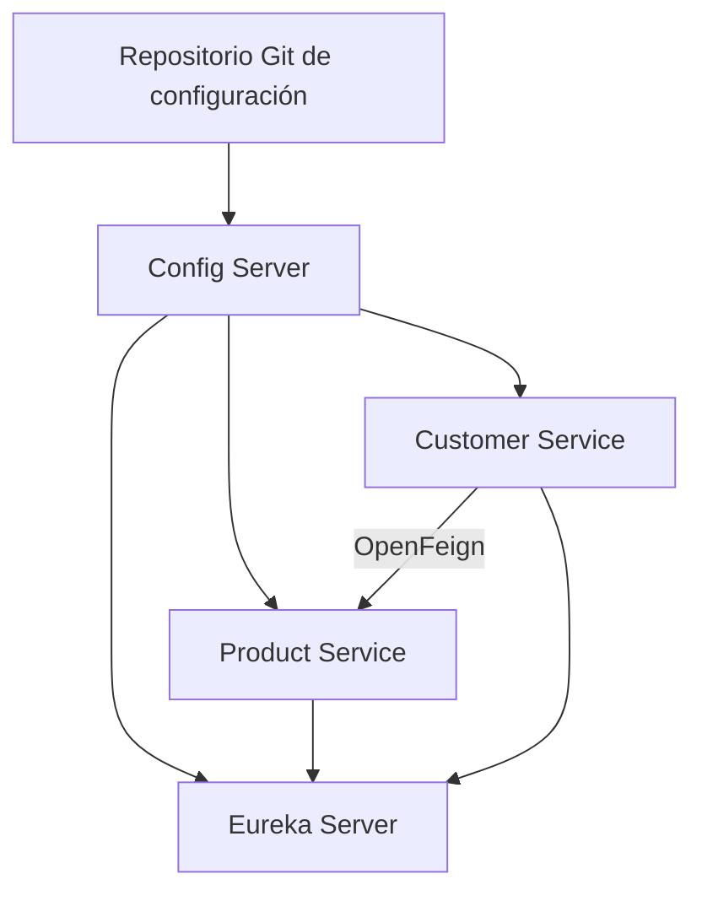

# TP Final - Ecosistema de Microservicios FinTech

Proyecto integrador desarrollado para la Diplomatura en Desarrollo de Software FinTech: IA y Microservicios.

El sistema implementa un ecosistema de microservicios con Spring Boot y Spring Cloud. Permite gestionar clientes y productos financieros, utilizando Eureka para el descubrimiento de servicios, OpenFeign para la comunicación entre microservicios y Spring Cloud Config para centralizar las configuraciones.

## Arquitectura

El ecosistema está compuesto por cuatro aplicaciones independientes:

- **config-server**: centraliza las configuraciones desde un repositorio Git remoto.
- **eureka-server**: registra y permite descubrir los microservicios disponibles.
- **product-service**: gestiona productos financieros asociados a clientes.
- **customer-service**: gestiona clientes y consulta sus productos mediante OpenFeign.



## Tecnologías utilizadas

- Java 21
- Spring Boot
- Spring Cloud
- Spring Cloud Config
- Netflix Eureka
- OpenFeign
- Spring Data JPA
- H2 Database
- Maven
- Postman
- Git y GitHub

## Estructura del repositorio

```text
TP-FINAL-microservicios/
├── config-server/
├── eureka-server/
├── product-service/
├── customer-service/
└── README.md
```

## Repositorio remoto de configuraciones

El repositorio utilizado por Config Server es:

https://github.com/sirfrancode/tp-config-repo

## Puertos

| Aplicación | Puerto |
|---|---:|
| Config Server | 8888 |
| Eureka Server | 8761 |
| Customer Service | 8081 |
| Product Service | 8082 |

## Orden de ejecución

Los servicios deben iniciarse en este orden:

1. `config-server`
2. `eureka-server`
3. `product-service`
4. `customer-service`

Este orden permite que los servicios obtengan primero su configuración y después se registren correctamente en Eureka.

## Ejecución

Cada proyecto puede ejecutarse desde IntelliJ IDEA utilizando su clase principal.

También puede ejecutarse desde una terminal ubicada dentro de cada proyecto.

Linux o macOS:

```bash
./mvnw spring-boot:run
```

Windows:

```powershell
.\mvnw.cmd spring-boot:run
```

## Verificación de infraestructura

### Config Server

Configuración de Product Service:

```text
http://localhost:8888/product-service/default
```

Configuración de Customer Service:

```text
http://localhost:8888/customer-service/default
```

### Eureka Dashboard

```text
http://localhost:8761
```

En el dashboard deben aparecer registrados:

```text
PRODUCT-SERVICE
CUSTOMER-SERVICE
```

## Endpoints de Product Service

URL base:

```text
http://localhost:8082/products
```

| Método | Endpoint | Descripción |
|---|---|---|
| POST | `/products` | Crear un producto |
| GET | `/products` | Listar todos los productos |
| GET | `/products/{id}` | Buscar un producto por ID |
| GET | `/products/customer/{customerId}` | Listar productos de un cliente |
| PUT | `/products/{id}` | Actualizar un producto |
| DELETE | `/products/{id}` | Eliminar un producto |

### Ejemplo para crear un producto

```json
{
  "customerId": 1,
  "name": "Cuenta Corriente",
  "type": "ACCOUNT",
  "balance": 150000
}
```

## Endpoints de Customer Service

URL base:

```text
http://localhost:8081/customers
```

| Método | Endpoint | Descripción |
|---|---|---|
| POST | `/customers` | Crear un cliente |
| GET | `/customers` | Listar todos los clientes |
| GET | `/customers/{id}` | Buscar un cliente por ID |
| GET | `/customers/{id}/products` | Consultar un cliente junto con sus productos |
| PUT | `/customers/{id}` | Actualizar un cliente |
| DELETE | `/customers/{id}` | Eliminar un cliente |

### Ejemplo para crear un cliente

```json
{
  "name": "Enzo Fernández",
  "document": "40123456",
  "email": "enzo@email.com",
  "balance": 250000
}
```

## Comunicación mediante OpenFeign

`customer-service` utiliza un Feign Client para consumir el siguiente endpoint de `product-service`:

```text
GET /products/customer/{customerId}
```

La comunicación utiliza el nombre lógico:

```text
product-service
```

Eureka localiza la instancia correspondiente sin necesidad de escribir directamente la URL o el puerto.

El endpoint que demuestra la integración completa es:

```text
GET http://localhost:8081/customers/{id}/products
```

### Ejemplo de respuesta

```json
{
  "id": 1,
  "name": "Enzo Fernández",
  "document": "40123456",
  "email": "enzo@email.com",
  "balance": 250000,
  "products": [
    {
      "id": 1,
      "customerId": 1,
      "name": "Cuenta Corriente",
      "type": "ACCOUNT",
      "balance": 150000
    }
  ]
}
```

## Persistencia

Los servicios utilizan bases de datos H2 en memoria:

- `customersdb`
- `productsdb`

Al detener o reiniciar los servicios, los datos almacenados pueden perderse.

## Diseño del proyecto

Los microservicios de negocio utilizan una arquitectura por capas:

```text
controller
service
repository
entity
dto
mapper
exception
```

`customer-service` también contiene el paquete:

```text
client
```

Allí se encuentra la interfaz de OpenFeign.

Los controllers trabajan con DTOs y no exponen directamente las entidades. Los mappers realizan las conversiones entre DTOs y entidades.

## Manejo de excepciones

Se implementaron excepciones personalizadas y `@RestControllerAdvice` para devolver respuestas claras cuando un cliente o producto no existe.

Ejemplo:

```json
{
  "timestamp": "2026-07-23T00:38:05",
  "status": 404,
  "message": "Producto no encontrado con id: 999"
}
```

## Pruebas realizadas

Los endpoints fueron probados utilizando Postman.

Se verificó:

- creación y consulta de clientes;
- creación y consulta de productos;
- búsqueda de productos por ID de cliente;
- respuestas `404` para recursos inexistentes;
- registro de los servicios en Eureka;
- lectura de configuraciones desde Config Server;
- comunicación entre Customer Service y Product Service mediante OpenFeign.

## Estado del proyecto

Proyecto finalizado y preparado para revisión de código.
